# csharp-kafka-events-workshop

This workshop/activity/tutorial will guide you through the creation of an application that demonstrates Apache Kafka and Event Handling using the C# programming language.   

At the end of this tutorial you will have:  
1. An instance of OpenShift running in Developer Sandbox for Red Hat Openshift. This will be referred to as your "cluster".  
1. A trial instance of Red Hat's managed Kafka offering.  
1. An application that produces events and sends them to your Kafka instance. This application is written in C#.  
1. An instance of a PostgreSQL database running in your OpenShift cluster.  
1. An instance of a MariaDB database running in your OpenShift cluster.  
1. An application that reads from your Kafka instance and writes the events to an event store. This application is written in C#.  
1. An application that reads from your event store, performs a summary for a given date, and writes to your MariaDB database. This application is written in C#.  
1. An application that is a web page to control and view your system.

## Note from the author  
Yes, this tutorial is lengthy and involves many moving parts: Four microservices, two databases, a Kafka instance, and a web interface. This is a result of my attempt to mimic a real world situation. This is not just a simple "Hello world" example; this tutorial will yield useable information for your own use of Kafka and/or an Event Store.

## Prerequisites  
The following prerequisites are necessary:  
1. An account in Developer Sandbox for Red Hat OpenShift (No problem; it's free). This is not actually *necessary*, since you can use this tutorial with any OpenShift cluster *as long as the Service Binding Operator is installed*.  If you don't have access to a cluster with the Service Binding Operator, or just want to experiment on your own, the Developer Sandbox is perfect.  
1. An instance of Red Hat OpenShift Stream for Apache Kafka (Again, it's free)  
1. The `oc` command-line tool for OpenShift. There are instructions later in this article for the installation of `oc`.
1. The `rhoas` command-line tool for Red Hat service binding. There are instructions later in this article for the installation of `rhoas`.  

## High-level overview 
Here's what you'll be doing:
1. Provisioning your OpenShift sandbox (i.e. your cluster)  
1. Creating a PostgreSQL database  
1. Creating a MariaDB database  
1. Creating an app to consume events and write to an event store  
1. Preparing your managed Kafka instance  
1. Creating an app to produce events  
1. Creating an app that summarizes a day's events and stores the results in a database
1. Creating a web app to view and control this system  


## 1. Provisioning your OpenShift sandbox (i.e your cluster)  
### 1.1 Get your sandbox
The Developer Sandbox for Red Hat OpenShift is a free offering from Red Hat that gives you developer-level access rights to an OpenShift cluster. If you have not already signed up for this free cluster, do so by visiting [the Developer Sandbox web page](https://developers.redhat.com/developer-sandbox).  

If you are using your own cluster, [the Service Binding Operator must be installed](https://docs.openshift.com/container-platform/4.9/applications/connecting_applications_to_services/installing-sbo.html).  

### 1.2 Install the 'oc' CLI  
The `oc` command line interface (CLI) allows you to work with your OpenShift cluster from a terminal command line. The `oc` CLI for OpenShift can be installed by following the instructions on [the oc CLI Getting Started web page](https://docs.openshift.com/container-platform/4.9/cli_reference/openshift_cli/getting-started-cli.html).

### 1.3 Log in to your sandbox from the command line
Open a terminal session on your local machine and use the `oc login` command to log into your cluster from there. The instructions for doing that are in [this short article](https://developers.redhat.com/blog/2021/04/21/access-your-developer-sandbox-for-red-hat-openshift-from-the-command-line).  This can be done using macOS, Windows, and Linux.

## 2. Creating a PostgreSQL database
## 3. Creating a MariaDB database
## 5. Creating an app to consume events and write to an event store
## 4. Preparing your managed Kafka instance  
### 4.1 Get your managed Kafka instance  
Go to https://developers.redhat.com/products/red-hat-openshift-streams-for-apache-kafka/getting-started  

Click on "Try our Kafka service at no cost" (red) button. You may be prompted to log in to your Red Hat Developer account:  

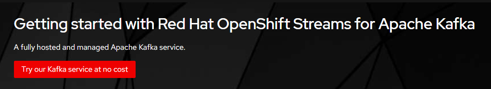


You'll arrive at the Red Hat cloud console and be able to start the process to create a Kafka instance for your own use.  

Click "Create Kafka instance" button:  

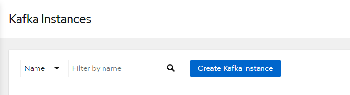


Supply a name and select a Cloud region and then click the "Create instance" button. *The name doesn't matter*, but you'll need to remember it. Of course, a best practice would be to make the name align with its purpose:  

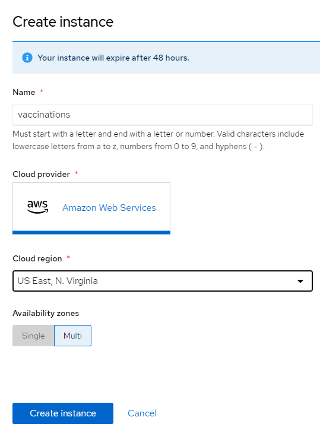


You will return to the Red Hat cloud console and will see you instance with a status of "Creation pending". This status will soon change to "Creation in progress".  

After a few minutes the status will change to "Ready". If you don't see this, try refreshing your browser ocassionally until you see this status. At this moment you have a Kafka instance for your own use.  

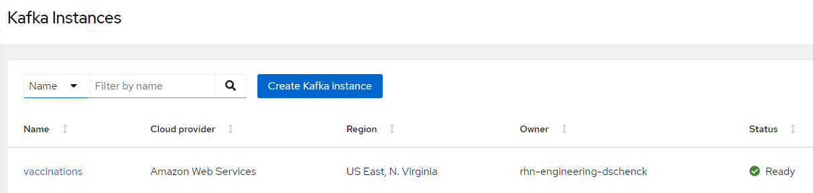

### 4.2 Install the 'rhoas' CLI
The `rhoas` (Red Hat OpenShift Application Services) CLI can be installed by following the instructions on [the `rhoas` CLI installation page](https://access.redhat.com/documentation/en-us/red_hat_openshift_application_services/1/guide/b9d4f17b-923f-49a6-b513-954399fc2ddd). This CLI is needed to use the Service Binding that connects your Kafka instance to your application.

### 4.3 Log in  
Run this command to log into your Red Hat OpenShift Application Services account. 

`rhoas login`

Note that the command will open a tab in your default web browser, after which you can return to your terminal session. If you don't have a browser available you can run the `rhoas login --help` command and investigate the `--token` option.

In case you're interested in some of the behind-the-scenes action: This command updates the rhoas CLI config file with the access token. The file is located at:

* macOS: $HOME/Library/Application Support/rhoas/config.json  
* Linux: $XDG_CONFIG_HOME/rhoas/config.json, falls back to $HOME/.config/rhoas/config.json  
* Windows: C:\Users\<username>\AppData\Roaming\rhoas\config.json  

Once you've logged in you can run the following command and see your Kafka instance listed. This proves that you are "connected" to it from your machine.

`rhoas kafka list`  

Here's an example:  
```console
❯ rhoas kafka list  
  ID                     NAME                      OWNER                      STATUS   CLOUD PROVIDER   REGION
 ---------------------- ------------------------- -------------------------- -------- ---------------- -----------  
 c821l7an7js5nj3rfua0   vaccinations              rhn-engineering-dschenck   ready    aws              us-east-1  

```


### 4.4 Determine which kafka instance to use  
It's possible to have more than one Kafka instance available to you (in order words, `rhoas kafka list` shows multiple instances), so it's necessary to specify which one you want to use. This is done by using the command `rhoas kafka use`. Here's an example:  

`rhoas kafka use --name vaccinations`  

```console
❯ rhoas kafka use --name vaccinations
 Kafka instance "vaccinations" has been set as the current instance.
```

### 4.5 Create a Kafka topic
Events are written to and retrieved from Kafka by subscribing to a specific "topic" within a specific Kafka instance. At this point it is necessary to create a topic within the "vaccinations" instance. Our event producer has the topic "us" hard-coded into it, so we need to create that topic. Use the following command to create the topic:  

`rhoas kafka topic create --name us`

```console
❯ rhoas kafka topic create --name us
Topic "us" created in Kafka instance "vaccinations":
<<several lines removed for brevity>>
```

The command will return a lot of JSON with information about the topic. You can prove the existence further by using the following command:  

`rhoas kafka topic list`

```console
❯ rhoas kafka topic list
  NAME   PARTITIONS   RETENTION TIME (MS)   RETENTION SIZE (BYTES)
 ------ ------------ --------------------- ------------------------
  us              1   604800000             -1 (Unlimited)
```

### 4.6 Get the token needed to connect to your cluster
You will need an authentication token in order for your Kafka isntance to connect to your OpenShift cluster. Get that token by visiting the following web page:

https://console.redhat.com/openshift/token

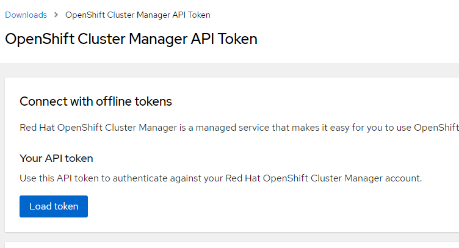

Click on the blue "Load token" button to review a token which can be copied to your machine's clipboard:

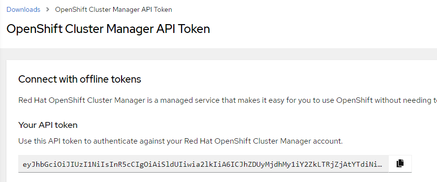

Click the small "copy" icon on the right side of the API token to copy the token to your machine's clipboard.

With the token in your machine's clipboard, run the following command:

`rhoas cluster connect --token {{insert_your_token_here}}`

When prompted, choose "kafka" as the type of service.

The resulting output will be verbose, but toward the end of it is a very important note: 

```console

Client ID:     <<redacted>

Make a copy of the client ID to store in a safe place. Credentials won't appear again after closing the terminal.

You will need to assign permissions to service account in order to use it.

You need to separately grant service account access to Kafka by issuing following command

  $ rhoas kafka acl grant-access --producer --consumer --service-account <redacted> --topic all --group all

 kafka resource "vaccinations" has been created
Waiting for status from kafka resource.
Created kafka can be already injected to your application.

To bind you need to have Service Binding Operator installed:
https://github.com/redhat-developer/service-binding-operator

You can bind kafka to your application by executing "rhoas cluster bind"
or directly in the OpenShift Console topology view.

 Connection to service successful.
Sending telemetery information for rhoas cluster connect
```
Like some of the previous commands, this command will update your config.json file associated with Service Binding. This is user later when you bind your Kafka instance to your service running in OpenShift.


As noted near the end of the output from the `rhoas cluster connect` command, you must run the `rhoas kafka acl grant-access` command. Here's an example:

```console
❯ rhoas kafka acl grant-access --producer --consumer --service-account srvc-acct-6d9fe894-02e3-4279-aa53-XXXXXXXXXX --topic all --group all
The following ACL rules will be created:

  PRINCIPAL (7)                                    PERMISSION   OPERATION   DESCRIPTION
 ------------------------------------------------ ------------ ----------- -------------------------
  srvc-acct-6d9fe894-02e3-4279-aa53-XXXXXXXXXXXX   allow        describe    topic is "*"
  srvc-acct-6d9fe894-02e3-4279-aa53-XXXXXXXXXXXX   allow        read        topic is "*"
  srvc-acct-6d9fe894-02e3-4279-aa53-XXXXXXXXXXXX   allow        read        group is "*"
  srvc-acct-6d9fe894-02e3-4279-aa53-XXXXXXXXXXXX   allow        write       topic is "*"
  srvc-acct-6d9fe894-02e3-4279-aa53-XXXXXXXXXXXX   allow        create      topic is "*"
  srvc-acct-6d9fe894-02e3-4279-aa53-XXXXXXXXXXXX   allow        write       transactional-id is "*"
  srvc-acct-6d9fe894-02e3-4279-aa53-XXXXXXXXXXXX   allow        describe    transactional-id is "*"
? Are you sure you want to create the listed ACL rules? Yes
 ACLs successfully created in the Kafka instance "vaccinations"
 ```

If you look at your cluster's web-based dashboard, you'll now see the Apache Kafka Connection object:

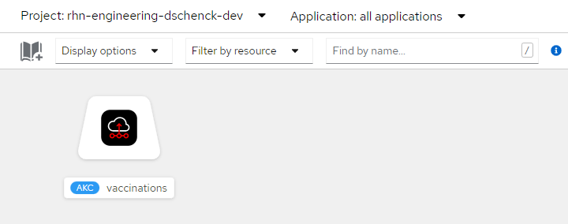

At this point we're ready to "bind" our Kafka instance to our application. More specifically, the Service Binding tool will look for any DeploymentConfig objects in your current OpenShift project and will let you select the one with which you wish to bind your Kafka instance.

But wait; we don't *have* an application. For this tutorial, we haven't created that DeploymentConfig yet. That's the next step.

## 5. Creating an app to produce events  
The first step in this entire suite of applications is to have a service in OpenShift that produces events and deposits them into the proper topic in our Kafka instance. This is the source of our events. An Event Source is where events are generated. An Event Sink is where events are consumed.

### 5.1 View the source code — this is optional
If you wish to see the code that will be implemented, check out [this Github repository](https://github.com/DonSchenck/vac-seen-generator).

### 5.2 Hard-coded values
Several values are hard-coded inside the application. *Part* of the reason for this is to mimic the real-world implementation of a microservice.

If this were the actual vaccination tracking system, you would expect every country to create their own reporting system. In that context, hard-coding the country code, vaccination types, and other specific information makes sense.

### 5.3 What we're doing
This application will create from one to 40 vaccination events per day for the past 30 days.  

The type of shot (e.g. Pfizer or Moderna), the shot number (1st vaccination, 2nd, booster) and number of events for that day are all randomly generated.

### 5.4 How the Service Binding works
When this application starts, it has no knowledge of the Kafka instance to which it will produce events. In order to write to Kafka, this application needs to know the following:  
* URI of the bootstrap server
* Topic — hard-coded as "us"
* Security Protocol
* SaslMechanicm
* SaslUsername
* SaslPassword

If you were not using Service Binding, you would need to supply those values to your code, probably by using environment variables and OpenShift Secrets.

But for our tutorial — other than the topic — the information is supplied by the Service Binding mechanism. Here is how that mechanism works:

When you run the command `rhoas service bind`, the rhoas CLI will gather the needed information from your active Kafka cluster. It will then use the token in your config.json file to connect to your cluster and retrieve a list of DeploymentConfigs in your current project.

You are presented with that list, and you select a Deployment. The tool will then create (or add to, if already existing) a directory in the root directory of that Deployment's container, called "bindings". Inside that "bindings" directory, a directory is created for your Kafka instance, and files are added containing the needed information, i.e. URI, Security Protocol, etc.

When this happens, the existing pod in the container is destroyed and replaced with a new pod. This new pod has visibility to the new "bindings" directory (and sub-directories). The application can then read from these files, get the information needed, and begin sending events to Kafka.


### 5.5 The app
The source code for the application can be found at this Github repo:

[https://github.com/DonSchenck/vac-seen-generator.git](https://github.com/DonSchenck/vac-seen-generator.git)

You **do not** need to clone or download this repo. Instead, we'll use the OpenShift option to build our application from a Github repo.

### 5.6 Creating the app
In the OpenShift dashboard, make sure you are in the Developer perspective.  

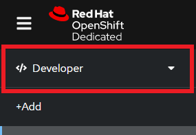

Click on the +Add option to reveal the Add options panel.  

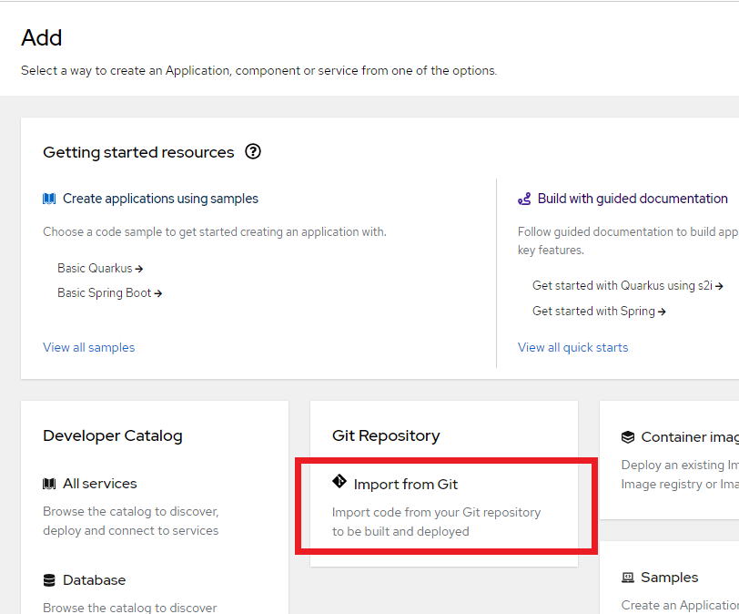  

Click on the "Import from Git" card to be prompted for the information needed to get the source from a Git repo and build our application:  

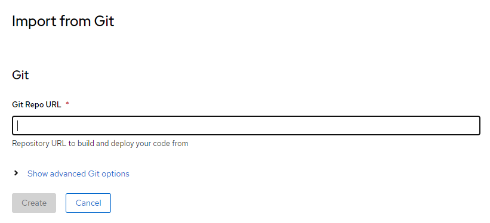  

Copy and paste the Github repo URL (https://github.com/DonSchenck/vac-seen-generator.git) into the prompt. OpenShift will immediately inspect the source code and determine the most likely build method. In this case, it chooses "Dockerfile", which is correct. OpenShift will use the Dockerfile in our source code to build the application.

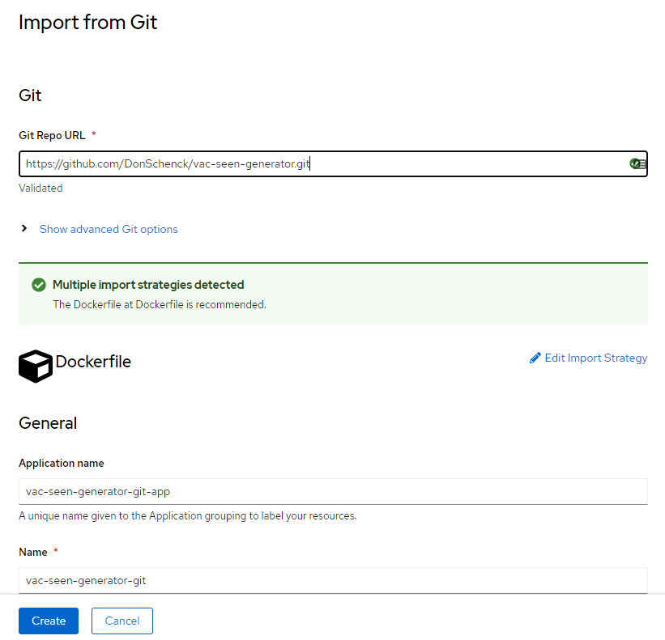  

Click the Create button to start the build. In a few minutes we'll have our application up and running.

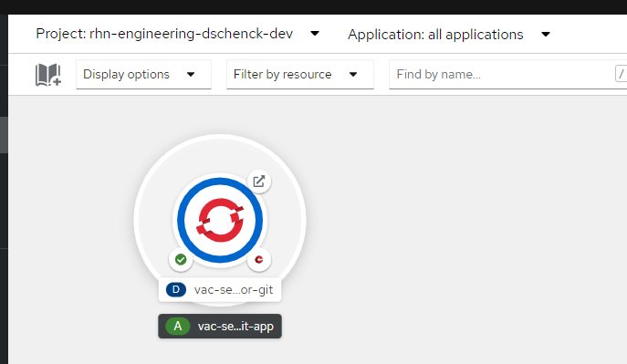  


### 5.7 Binding Kafka and our App
At this point we have a Kafka instance, and we have an application. However, we have not yet bound the instance to the app as explained in section 3.4.  

We can see this fact — the fact that it's not bound to Kafka — by viewing the logs at the command line. Use the following command (press Ctrl-C to end the streaming log messages):

`oc logs -l app=vac-seen-generator -f`  

Here's an example:
```console
❯ oc logs -l app=vac-seen-generator-git -f
Waiting for service binding...
Waiting for service binding...
Waiting for service binding...
Waiting for service binding...
Waiting for service binding...
Waiting for service binding...
Waiting for service binding...
Waiting for service binding...
Waiting for service binding...
Waiting for service binding...
```
Binding the Kafka instance to our application is one simple command at the command line. Let's do that now.

Return to your command line and run the following command:

`rhoas cluster bind`  

This will as you to select a Deployment. Choose "vac-seen-generator". This will bind your Kafka instance to your application.

Here's an example:

```console
❯ rhoas cluster bind
Namespace not provided. Using rhn-engineering-dschenck-dev namespace
Looking for Deployment resources. Use --deployment-config flag to look for deployment configs
? Please select application you want to connect with vac-seen-generator-git
? Select type of service kafka
Binding "vaccinations" with "vac-seen-generator-git" app
? Do you want to continue? Yes
Using ServiceBinding Operator to perform binding
 Binding vaccinations with vac-seen-generator-git app succeeded
 ```

If you run the `oc logs -l app=vac-seen-generator-git` command again, you will see evidence of the events being generated. Here's an example:

```console
❯ oc logs -l app=vac-seen-generator-git
Delivered message to us [[0]] @2692
{"RecipientID":"dc5e646f-491f-4bd7-8bcc-f320499ece8e","EventTimestamp":"2022-02-12T19:13:07.8024849+00:00","CountryCode":"US","VaccinationType":"Johnson & Johnson","ShotNumber":2}
Delivered message to us [[0]] @2693
{"RecipientID":"806cc197-5117-499d-b0a1-e987b38bf0bc","EventTimestamp":"2022-02-12T19:13:07.8024849+00:00","CountryCode":"US","VaccinationType":"Pfizer","ShotNumber":2}
Delivered message to us [[0]] @2694
{"RecipientID":"4a8a333d-658d-4b36-84d7-ce9e85d31541","EventTimestamp":"2022-02-12T19:13:07.8024849+00:00","CountryCode":"US","VaccinationType":"Johnson & Johnson","ShotNumber":2}
Delivered message to us [[0]] @2695
{"RecipientID":"15b90150-88b0-4820-93c7-84cf2d313aba","EventTimestamp":"2022-02-12T19:13:07.8024849+00:00","CountryCode":"US","VaccinationType":"Pfizer","ShotNumber":2}
Delivered message to us [[0]] @2696
{"RecipientID":"6c2eeb40-9934-447e-89ba-8a75f4a4f427","EventTimestamp":"2022-02-12T19:13:07.8024849+00:00","CountryCode":"US","VaccinationType":"Moderna","ShotNumber":2}
```

Note that these log entries exist *only* because I am writing the events to the console in my application. This is probably a bad idea for performance, but it's good for a demo.

### Congratulations
You have an application running in OpenShift, that is connected to your Managed Kafka instance and is creating events.


